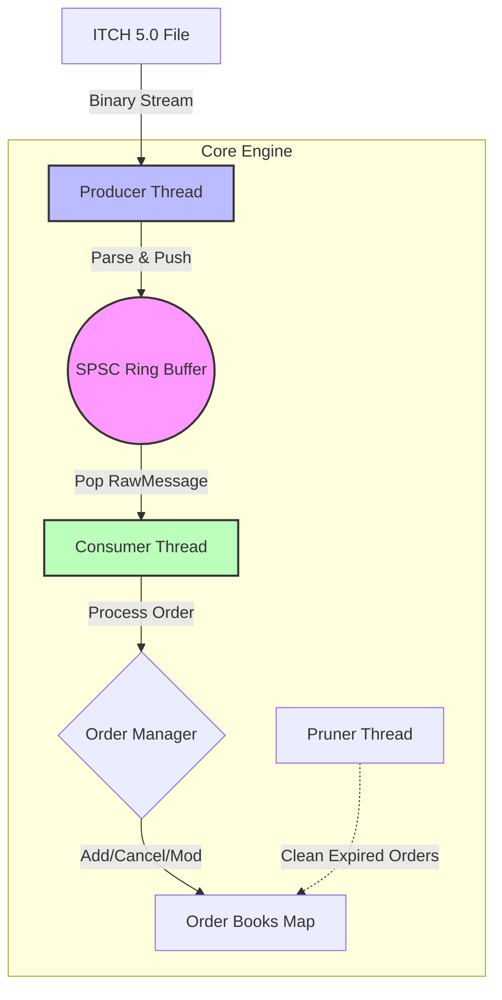

# HFT Trading Engine

A high-performance, low-latency trading engine simulation written in Modern C++20. This project demonstrates the implementation of a Limit Order Book (LOB) fed by a NASDAQ ITCH 5.0 market data feed, utilizing a custom lock-free Single Producer Single Consumer (SPSC) ring buffer for efficient inter-thread communication.

---

## Demo


---

## Architecture

The system follows a producer-consumer pattern to decouple market data parsing from order book processing.



1.  **Producer:** Reads the ITCH 5.0 binary file, parses message headers, and pushes raw message bytes into the ring buffer.
2.  **SPSC Ring Buffer:** A lock-free, cache-friendly queue that facilitates low-latency data transfer.
3.  **Consumer:** Pulls messages, interprets the specific ITCH message type (Add, Cancel, Update), and updates the relevant Order Book.
4.  **Pruner:** A background thread that monitors market hours and cleans up "Good-Till-Day" orders after market close.

---

## SPSC Optimization Measurements

The core of the engine's performance lies in the optimization of the SPSC FIFO queue. Below is the progression of performance gains achieved through various techniques:


| Optimization Step | Throughput | Improvement |
|-------------------|------------|-------------|
| **1. Baseline (No Atomics)** | 10.66 M/s | - |
| **2. Atomic Cursors** | 4.54 M/s | (Regression due to atomic operation cost) |
| **3. Cache Alignment** | 5.35 M/s | +17% |
| **4. Acquire/Release Semantics** | 8.34 M/s | +56% |
| **5. Cursor Caching** | 22.22 M/s | +166% |
| **6. Power of 2 Buffer (Bitwise Mod)** | 34.31 M/s | +54% |
| **7. Compiler Optimizations (-O3)** | **218.21 M/s** | **+536%** |


---

## Features

*   **NASDAQ ITCH 5.0 Parser:** Efficiently parses binary market data messages (Add Order, Order Executed, Order Cancel, Order Delete, Order Replace).
*   **Lock-Free SPSC Queue:** Custom implementation using `std::atomic` with explicit memory ordering (`acquire`/`release`) and `std::hardware_destructive_interference_size` for cache line alignment to prevent false sharing.
*   **Limit Order Book:** Full support for Price-Time priority matching, order modifications, and cancellations.
*   **Modern C++20:**
    *   `std::jthread` and `std::stop_token` for safe thread management.
    *   `std::span` for zero-copy buffer views.
    *   `std::atomic` for lock-free synchronization.
    *   `[[no_unique_address]]` for allocator optimization.
*   **Safety & Testing:**
    *   Comprehensive Unit Tests using **Google Test**.
    *   Performance benchmarks using **Google Benchmark**.
    *   Automated builds with **Address**, **Thread**, **Memory**, and **Undefined Behavior** sanitizers.

## Project Structure

```text
├── include/
│   ├── ringbuffer.h       # Lock-free SPSC implementation
│   ├── itchparser.h       # ITCH 5.0 protocol parser
│   └── orderbook/         # Order Book logic and data structures
├── src/
│   ├── main.cpp           # Entry point: Thread setup and event loop
│   └── orderbook/         # Order Book implementation
├── tests/
│   ├── ringbench.cpp      # Google Benchmark for Ring Buffer
│   └── ringtest.cpp       # Google Test for Ring Buffer correctness
├── itch/                  # ITCH 5.0 data files
├── all_builds.sh          # Helper script for Release and Debug/Sanitizer builds
└── conanfile.py           # Dependency management
```

## Getting Started

### Prerequisites

*   **C++20 Compiler** (GCC 11+, Clang 14+, MSVC 19.29+)
*   **CMake** (3.23+)
*   **Conan** (2.x) package manager
*   **Ninja** build system (optional, but recommended)

### Build Instructions

The project includes a helper script `all_builds.sh` that compiles the project in **Release** mode and multiple **Debug** modes with different sanitizers.

```bash
# Make the script executable
chmod +x all_builds.sh

# Run the build script
./all_builds.sh
```

This will generate:
*   `build/Release/TradingEngine`: Optimized release binary.
*   `build/Debug/TradingEngine_asan`: Debug binary with Address Sanitizer.
*   `build/Debug/TradingEngine_tsan`: Debug binary with Thread Sanitizer.
*   `build/Debug/TradingEngine_msan`: Debug binary with Memory Sanitizer.
*   `build/Debug/TradingEngine_ubsan`: Debug binary with Undefined Behavior Sanitizer.

### Running the Engine

You need a NASDAQ ITCH 5.0 file to run the engine.

```bash
# Syntax: ./TradingEngine <path_to_itch_file>
./build/Release/TradingEngine itch/ITCH50.txt
```

### Running Tests

```bash
cd build/Release
ctest --output-on-failure
```

## Performance Details

### Memory Layout
The `RingBuffer` is designed to minimize cache coherency traffic between the producer and consumer cores.
*   **Padding:** `push_cursor_` and `pop_cursor_` are aligned to `std::hardware_destructive_interference_size` (typically 64 bytes) to ensure they reside on separate cache lines.
*   **Caching:** Local copies of the cursors (`cached_push_cursor_`, `cached_pop_cursor_`) are maintained to reduce the frequency of atomic loads.

### Zero-Copy Parsing
The parser casts raw byte sequences directly into message structs (`ITCH50::AddOrderMsg`, etc.) using `reinterpret_cast`. This avoids expensive memory copying. Networking order (Big Endian) to Host order (Little Endian) conversion is handled immediately upon processing.
